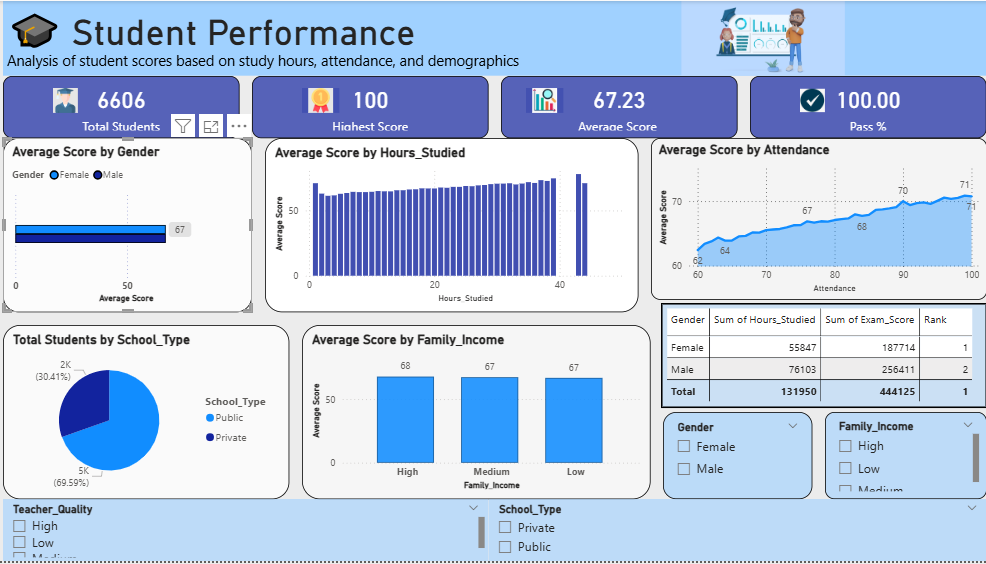

# 📊 Student Performance Analysis

## 📌 Overview
This project analyzes student performance data using SQL, Excel, and Power BI to identify trends and insights.

## 🛠 Tools Used
- SQL
- Excel
- Power BI

## 📈 Key Insights
- Students with higher study hours scored better marks
- Math scores are lower compared to reading & writing
- Parental education impacts student performance

## 📂 Files Included
- dataset.csv → Raw data
- queries.sql → SQL analysis
- dashboard.pbix → Power BI dashboard

## 📸 Dashboard Preview

